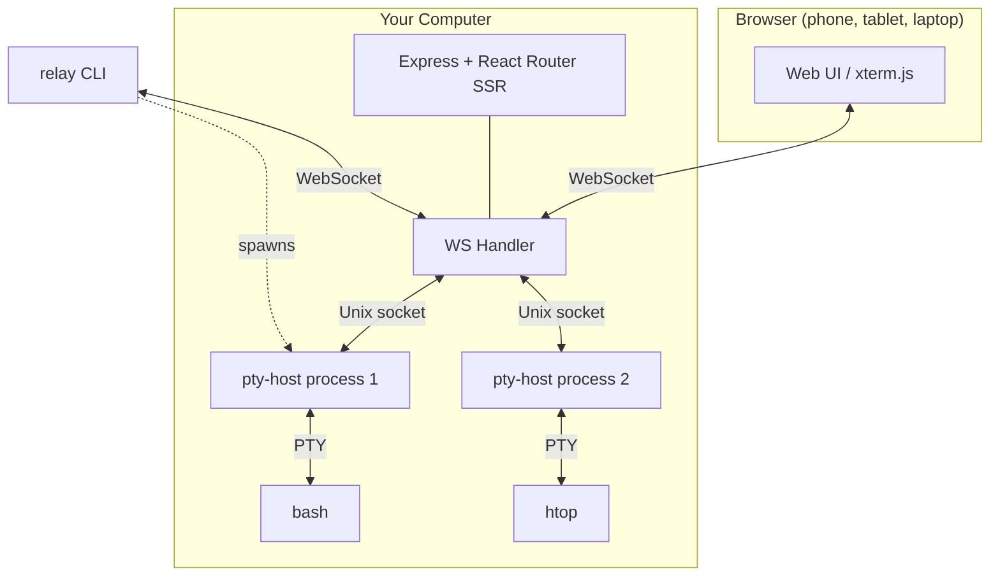

relay-tty uses a process-per-session architecture where each terminal session runs in its own isolated process.

## System overview

## Why process-per-session?

Each session runs in a **detached pty-host process** — a small Rust binary (~700KB, ~2MB RSS) that:

1. Owns the PTY file descriptor
2. Maintains a 10MB ring buffer of recent output
3. Serves multiple clients via Unix socket
4. Persists session metadata to disk

This design means:

- **Server crashes don't kill sessions** — pty-host processes survive independently
- **Server upgrades are seamless** — restart the server, sessions reconnect automatically
- **One crash can't cascade** — if a session's pty-host dies, others are unaffected
- **Memory is bounded** — each session uses ~2MB regardless of output volume

## The CLI spawns, the server bridges

A critical design choice: **the CLI spawns pty-host processes, not the server.** When you run `relay bash`, the CLI calls `spawnDirect()` so pty-host inherits your shell environment (PATH, SSH keys, virtualenvs, etc.). The server is only a WebSocket bridge — it discovers sessions from disk via `discoverOne()`.

## Output buffer

Each pty-host maintains a 10MB ring buffer. When a new client connects:

1. Client sends `RESUME(offset)` with its last known byte position
2. If offset is valid, pty-host sends only the delta (new data since offset)
3. If offset is too old (overwritten), pty-host sends a full replay
4. pty-host sends `SYNC(currentOffset)` so the client knows its position

This enables near-instant reconnection — close your laptop, open your phone, and the terminal is right where you left it with no visible delay.

## Tech stack

| Layer | Technology |
|-------|-----------|
| Frontend | React Router v7 (SSR) + Tailwind v4 + DaisyUI v5 + xterm.js v5 |
| Backend | Express 5 + ws |
| PTY Host | Rust (tokio + libc::forkpty) |
| CLI | Commander |
| Service | launchd (macOS) / systemd (Linux) |
| Tunnel | Multiplexed WS to relaytty.com |
