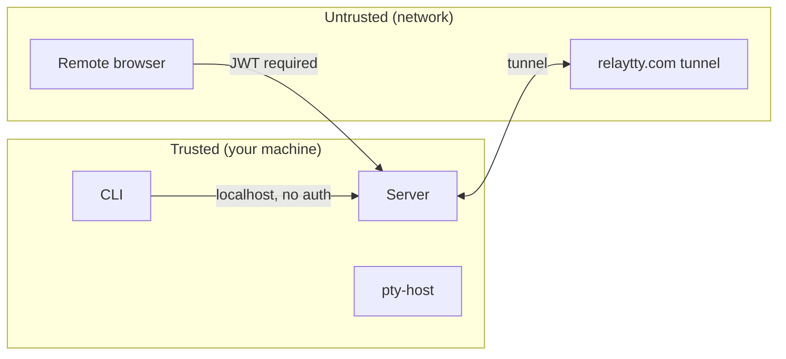

How relay-tty handles authentication, authorization, and trust boundaries.

## Trust boundaries

## Localhost bypass

Connections from `localhost` (127.0.0.1, ::1) skip authentication entirely. The CLI on the same machine always has full access.

## JWT authentication

For remote access (via tunnel or any non-localhost connection):

1. Set `JWT_SECRET` environment variable
2. Server generates a token on startup
3. Visit the auth callback URL to set a session cookie (30-day expiry)
4. All subsequent requests include the cookie automatically

The token does not expire. Rotate `JWT_SECRET` to revoke all tokens.

## Share tokens

Share links use signed JWTs with:

- **Session ID** — scoped to one session
- **Read-only flag** — viewers cannot type
- **TTL** — expires after the specified duration (default 1 hour, max 24 hours)
- **Optional password** — viewer must enter password before terminal loads

Share tokens are self-contained — no server-side state to manage or revoke (beyond JWT_SECRET rotation).

## What's NOT encrypted

- Unix socket communication between server and pty-host is local and unencrypted
- The tunnel connection to relaytty.com uses TLS (WSS)
- Localhost connections are plain HTTP (standard for local development)
