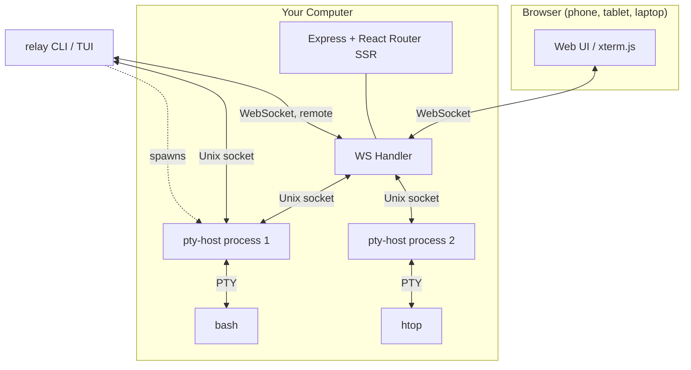

relay-tty uses a process-per-session architecture where each terminal session runs in its own isolated process.

## System overview

## One client core

Every client speaks the same framed binary protocol through `shared/client/`: a `SessionStream` (RESUME/SYNC handshake, byte-offset tracking, full versus delta replay, reconnect backoff, typed events) over a `Transport` that is either a Unix socket (length-prefixed frames) or a WebSocket (raw frames). The browser, `relay attach`, the TUI, the server's per-session monitors, and the CLI control commands (`send`, `rename`, `kill`) are all consumers of that one class. A `SessionDirectory` answers "what sessions exist and what state are they in" from disk (`~/.relay-tty/sessions`, watched) or from a remote server (`/api/sessions` plus `/ws/events`), so `relay tui --host` shows another machine's sessions with no code path of its own.

Clients that only need live events (server monitors, plugins) open a session with `OBSERVE` as the first frame: no replay, and pty-host does not count them as attached viewers.

## Agent state

pty-host computes an `agentState` for each session once a second: `working`, `blocked`, `done`, `idle`, or `unknown`. It looks at the foreground process name (Claude Code, Codex, opencode and others are recognized), the last few kilobytes of output with escape sequences stripped, and recent throughput. The field is written to the session JSON and broadcast in `SESSION_UPDATE`, so the sidebar, the TUI picker, push notifications, and `relay wait --state blocked` all read the same value. The rules are a table in `crates/pty-host/src/agent_state.rs`.

## Why process-per-session?

Each session runs in a **detached pty-host process** — a small Rust binary (~700KB, ~2MB RSS) that:

1. Owns the PTY file descriptor
2. Maintains a 10MB ring buffer of recent output
3. Serves multiple clients via Unix socket
4. Persists session metadata to disk

This design means:

- **Server crashes don't kill sessions** — pty-host processes survive independently
- **Server upgrades are seamless** — restart the server, sessions reconnect automatically
- **One crash can't cascade** — if a session's pty-host dies, others are unaffected
- **Memory is bounded** — each session uses ~2MB regardless of output volume

## The CLI spawns, the server bridges

A critical design choice: **the CLI spawns pty-host processes, not the server.** When you run `relay bash`, the CLI calls `spawnDirect()` so pty-host inherits your shell environment (PATH, SSH keys, virtualenvs, etc.). The server is only a WebSocket bridge — it discovers sessions from disk via `discoverOne()`.

## Output buffer

Each pty-host maintains a 10MB ring buffer. When a new client connects:

1. Client sends `RESUME(offset)` with its last known byte position
2. If offset is valid, pty-host sends only the delta (new data since offset)
3. If offset is too old (overwritten), pty-host sends a full replay
4. pty-host sends `SYNC(currentOffset)` so the client knows its position

This enables near-instant reconnection — close your laptop, open your phone, and the terminal is right where you left it with no visible delay.

## Tech stack

| Layer | Technology |
|-------|-----------|
| Frontend | React Router v7 (SSR) + Tailwind v4 + DaisyUI v5 + xterm.js v5 |
| Backend | Express 5 + ws |
| PTY Host | Rust (tokio + libc::forkpty) |
| CLI | Commander |
| Service | launchd (macOS) / systemd (Linux) |
| Tunnel | Multiplexed WS to relaytty.com |
