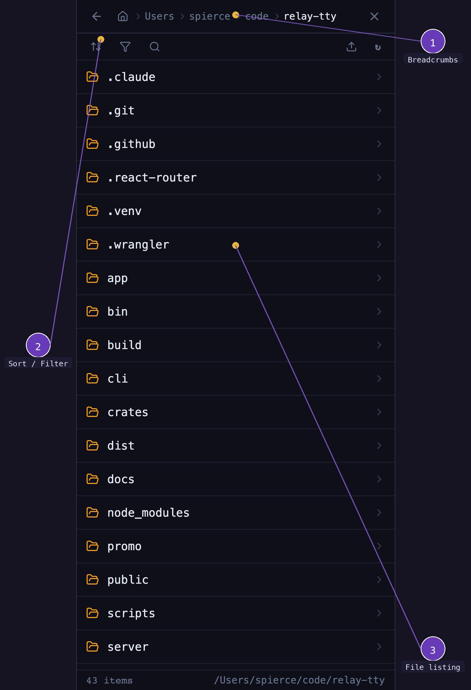

# File Browser

Browse and view files from the web UI without needing terminal commands.

<figure markdown="span">
  { width="300" }
  <figcaption>File browser showing project directory</figcaption>
</figure>

1. **Path breadcrumbs** — navigate up through the directory tree
2. **File listing** — directories and files with sizes and types
3. **Filter & sort** — toggle filters (files/dirs/hidden), sort by name/size/date, search

## Opening the file browser

Tap the **folder** icon in the session header to open the file browser panel.

## Navigating

- Click directories to drill down
- Use the breadcrumb path to navigate up
- File contents are displayed in a syntax-highlighted viewer

## Supported file types

The file viewer supports syntax highlighting for common programming languages and file formats.
