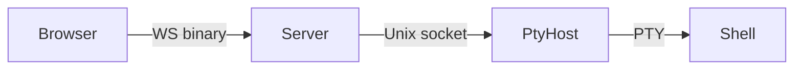

# WebSocket Protocol

relay-tty uses a binary protocol over WebSocket (browser to server) and length-prefixed frames over Unix sockets (server to pty-host).

For the full protocol specification including message types, framing format, and the delta resume handshake, see the [protocol specification](https://github.com/ddrscott/relay-tty/blob/main/docs/protocol.md) in the repository.

## Overview

## Key message types

| Type | Direction | Description |
|------|-----------|-------------|
| `DATA` (0x01) | Both | Terminal I/O data |
| `RESIZE` (0x02) | Client → Server | Terminal resize (cols, rows) |
| `RESUME` (0x10) | Client → Server | Resume from byte offset |
| `SYNC` (0x11) | Server → Client | Current byte offset after resume |
| `METRICS` (0x14) | Server → Client | Throughput metrics broadcast |

## Delta resume

On reconnect, the browser sends its last known byte offset via `RESUME`. The pty-host responds with only the delta (new data since that offset) plus a `SYNC` message. This enables near-instant reconnection without replaying the full buffer.

If the offset is too old (data has been overwritten in the ring buffer), the pty-host falls back to a full replay.
